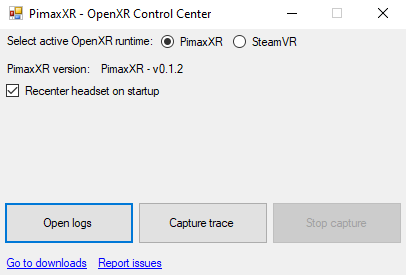

# PimaxXR: an OpenXR runtime for Pimax headsets

This program is an unofficial OpenXR runtime for Pimax headsets with minimal functionality. It is not produced by Pimax.

It is built on top of the official Pimax PVR native SDK and aims to provide a very fast and efficient implementation of the OpenXR standard for Pimax headsets. This runtime is not compliant and only implement what is necessary to run common OpenXR applications.

DISCLAIMER: This software is distributed as-is, without any warranties or conditions of any kind. Use at your own risks.

## Setup

Download the latest version from the [Releases page](https://github.com/mbucchia/Pimax-OpenXR/releases). Find the installer program under **Assets**, file `PimaxXR-X.Y.Z.msi`.

Once installed, the _PimaxXR Control Center_ application (shortcut on the Desktop, or available from the Start Menu) can be used to switch between PimaxXR and the StreamVR runtime.

For troubleshooting, the log file can be found at `%LocalAppData%\pimax-openxr\pimax-openxr.log`.

## Limitations

- Windows OS support only.
- Graphics support: Direct3D 11, Direct3D 12, Vulkan.
- No motion controller support.
- No parallel projection support.

Tested with the following applications with a Pimax 8KX:
- Microsoft Flight Simulator 2020*
- Digital Combat Simulator (DCS)* (through [OpenComposite](https://gitlab.com/znixian/OpenOVR/-/tree/openxr))
- Assetto Corsa* (through OpenComposite)
- Assetto Corsa Competizione (through OpenComposite)
- IL-2 Sturmovik (through OpenComposite)
- R.E.A.L mod (Cyberpunk 2077, Red Dead Redemption 2)
- War Thunder
- Unity
- Unreal Engine
- StereoKit*

(*) OpenXR Toolkit was tested with these applications.

## Known issues

- This runtime is not yet compatible with the OpenXR Toolkit. It may or may not work depending on the application.
  - Please disable the OpenXR Toolkit if you are having issues.
- Project Cars 2 (through OpenComposite) does not correctly display each eye.
- rFactor 2 (through OpenComposite) does not correctly display each eye.
- Applications hosted in a secure app container will fail to start: the Pimax SDK does not seem to support RPC in this configuration.

If you are having issues, please visit the [Issues page](https://github.com/mbucchia/Pimax-OpenXR/issues) to look at existing support requests or to file a new one.

**IMPORTANT**: When filing issues, please make sure to include the `pimax-openxr.log` log file. It can be opened from the _PimaxXR Control Center_ application (shortcut on the Desktop, or available from the Start Menu). Additionally, providing a full capture trace (see below) is greatly helpful.

Capturing a trace can be initiated from the _PimaxXR Control Center_, by clicking _Capture trace_, then reproduce the crash/issue. When done, click _Stop capture_. The folder containing the trace file (`%LocalAppData%\pimax-openxr`) will be opened, and the file is named `PimaxXR.etl`.

## Contributors

Special thanks to the following individuals for their contributions:

- Vladimir Dranyonkov
